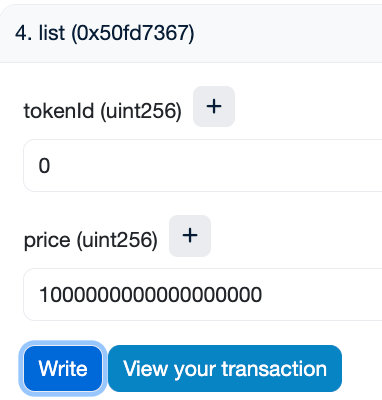

# 部署
## DylanNFT: address: 0x4cE957eC91bB99e45715b7dbb7536E55ff64DdBA
```shell
➜  NFTMarket_upgradeable git:(main) forge create --rpc-url sepolia --account Dylan_1A3
D DylanNFT           
[⠊] Compiling...
No files changed, compilation skipped
Enter keystore password:
Deployer: 0x524a3F4843b5b2c8BcC050fe6c82C7EDf50B1A3D
Deployed to: 0x4cE957eC91bB99e45715b7dbb7536E55ff64DdBA
Transaction hash: 0x0b8ac78e0562b24bd17de60bb1bb19afd129ba786dddf86a931e25a117b0796e
```

## DylanToken: address: 0x080ffA7F5b110Ec34d8689234F0eDa4b8C3C71A0
```shell
➜  NFTMarket_upgradeable git:(main) ✗ forge create --rpc-url sepolia --account Dylan_5900 DylanToken               
[⠒] Compiling...
No files changed, compilation skipped
Enter keystore password:
Deployer: 0x3A8492819b0C9AB5695D447cbA2532b879d25900
Deployed to: 0x080ffA7F5b110Ec34d8689234F0eDa4b8C3C71A0
Transaction hash: 0xc8fc016777584edf3efc2cf382096c1f6161f1d5d64269c495a3a8d7b90b9320
```

## NFTMarket_v1: address: 0xeA3186a85e82370EfA448137E6dff789d576d5B1
```shell
➜  NFTMarket_upgradeable git:(main) ✗ forge create --rpc-url sepolia --account Dylan_5900 NFTMarket_v1
[⠊] Compiling...
No files changed, compilation skipped
Enter keystore password:
Deployer: 0x3A8492819b0C9AB5695D447cbA2532b879d25900
Deployed to: 0xeA3186a85e82370EfA448137E6dff789d576d5B1
Transaction hash: 0x73b1bbbf896563b92056a26cc7ab86cd3fd4e2b2ab89b4c703ed4be382353b5c
```

## UUPS_Proxy: address: 0x3B35d8cd4b5Da415696b54e88d107c7F7b2596f1
```shell
➜  NFTMarket_upgradeable git:(main) ✗ forge create --rpc-url sepolia --account Dylan_5900 UUPS_Proxy --constructor-args 0xeA3186a85e82370EfA448137E6dff789d576d5B1 --verify       
[⠒] Compiling...
No files changed, compilation skipped
Enter keystore password:
Deployer: 0x3A8492819b0C9AB5695D447cbA2532b879d25900
Deployed to: 0x3B35d8cd4b5Da415696b54e88d107c7F7b2596f1
Transaction hash: 0xa09a982b159673cee27d9cab743c805f8ddb8c1c5cd7619c4a7eec0295804910
Starting contract verification...
Waiting for etherscan to detect contract deployment...
Start verifying contract `0x3B35d8cd4b5Da415696b54e88d107c7F7b2596f1` deployed on sepolia

Submitting verification for [src/UUPS_Proxy.sol:UUPS_Proxy] 0x3B35d8cd4b5Da415696b54e88d107c7F7b2596f1.
Submitted contract for verification:
        Response: `OK`
        GUID: `epjz9wwyc7umv5seczfu7bsa9echum27uadtzt1nlp52eqn8hq`
        URL: https://sepolia.etherscan.io/address/0x3b35d8cd4b5da415696b54e88d107c7f7b2596f1
Contract verification status:
Response: `OK`
Details: `Pass - Verified`
Contract successfully verified
```

# 交互
## 初始化
  
结果：  
  

## mintNFT + setApprovalForAll + list
铸造NFT:  
  

nftSeller授权代理合约:  
  

tokenId = 0 owner:  
  

isApprovedForAll:  
  

上架：  
  

查看上架信息：  
  

nftBuyer授权代理合约：  
  

## buy NFT
  

tokenId = 0 owner:  
  

# 升级合约
## 部署NFTMarket_v2: address: 0x2EaDD607E5Acc82ef972cDE9e62be27CC94FC21d
```shell
➜  NFTMarket_upgradeable git:(main) ✗ forge create --rpc-url sepolia --account Dylan_5900 NFTMarket_v2 --verify
[⠊] Compiling...
[⠘] Compiling 2 files with Solc 0.8.26
[⠃] Solc 0.8.26 finished in 672.56ms
Compiler run successful!
Enter keystore password:
Deployer: 0x3A8492819b0C9AB5695D447cbA2532b879d25900
Deployed to: 0x2EaDD607E5Acc82ef972cDE9e62be27CC94FC21d
Transaction hash: 0xc02e6b179c1bc1988bef273a47bdb1aea4f648387bcfcea823661841443a943c
Starting contract verification...
Waiting for etherscan to detect contract deployment...
Start verifying contract `0x2EaDD607E5Acc82ef972cDE9e62be27CC94FC21d` deployed on sepolia

Submitting verification for [src/NFTMarket_v2.sol:NFTMarket_v2] 0x2EaDD607E5Acc82ef972cDE9e62be27CC94FC21d.
Submitted contract for verification:
        Response: `OK`
        GUID: `zggrjdc1nfum5jakch47qqtdwucxcpnwvjnujk93vrdqxi1pqi`
        URL: https://sepolia.etherscan.io/address/0x2eadd607e5acc82ef972cde9e62be27cc94fc21d
Contract verification status:
Response: `NOTOK`
Details: `Pending in queue`
Contract verification status:
Response: `OK`
Details: `Pass - Verified`
Contract successfully verified
```

## 换实现合约
  

升级成功：  


## 使用签名购买
再次MintNFT，再次给代理合约授权Token，生成签名，忽略。

  

交易哈希：https://sepolia.etherscan.io/tx/0xf3d47f4cbb218feda5aa9f2f096b268963adb084aa73bb5225cc8cb61cd9fe8f
交易日志：https://sepolia.etherscan.io/tx/0xf3d47f4cbb218feda5aa9f2f096b268963adb084aa73bb5225cc8cb61cd9fe8f#eventlog