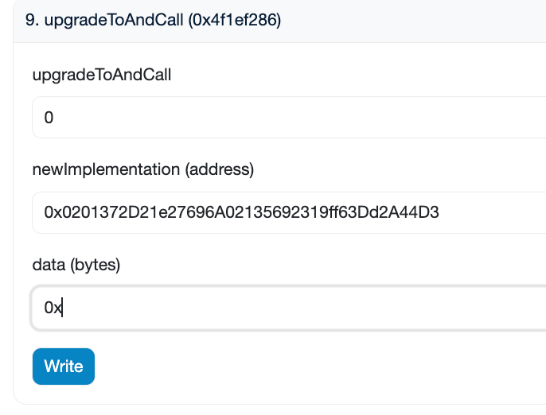
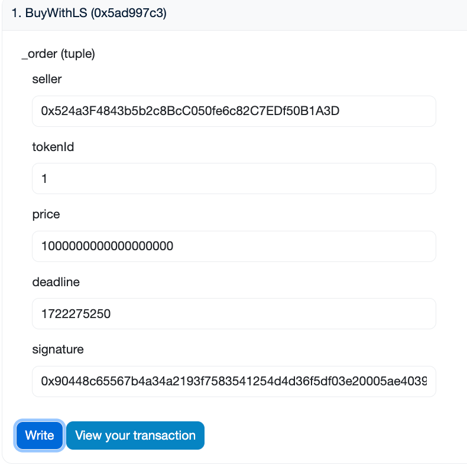

# 部署
## DylanToken: address : 0xBD1A56e4bC4E22ae10F13a242e62C40A87fF180A
```shell
➜  NFTMarket_upgradeable_from_OpenZeppelin git:(main) ✗ forge create --rpc-url sepolia --account Dylan_5900 DylanToken --verify
[⠔] Compiling...
No files changed, compilation skipped
Enter keystore password:
Deployer: 0x3A8492819b0C9AB5695D447cbA2532b879d25900
Deployed to: 0xBD1A56e4bC4E22ae10F13a242e62C40A87fF180A
Transaction hash: 0xe464587ce546a9b77e0c48e0d9a88694998c111be3e606e409f076530867aa1f
```

## DylanNFT: address: 0x8eDd5ED36B1e1dd1FB55e1D3A82DffB417825188
```shell
➜  NFTMarket_upgradeable_from_OpenZeppelin git:(main) ✗ forge create --rpc-url sepolia --account Dylan_1A3D DylanNFT           
[⠰] Compiling...
No files changed, compilation skipped
Enter keystore password:
Deployer: 0x524a3F4843b5b2c8BcC050fe6c82C7EDf50B1A3D
Deployed to: 0x8eDd5ED36B1e1dd1FB55e1D3A82DffB417825188
Transaction hash: 0xa62c3abfb623517bb1859b3d13436770d885cb9cba64fc5593ba0e0edd254bbb
```


## NFTMarket_v1: address: 0x644dBD7A52E93A02f34cf521A55ce3a309a70E83
```shell
➜  NFTMarket_upgradeable_from_OpenZeppelin git:(main) ✗ forge script script/deployNFTMarket_v1.s.sol --rpc-url sepolia --account Dylan_5900 --broadcast --verify

== Logs ==
  implementation_v1_contract address:  0x644dBD7A52E93A02f34cf521A55ce3a309a70E83

==========================

##### sepolia
✅  [Success]Hash: 0xdfc01a6b89e753413844d17569191cb06465efa8cdb3f000c1a2ab9fe8586b9f
Contract Address: 0x644dBD7A52E93A02f34cf521A55ce3a309a70E83
Block: 6395403
Paid: 0.005661632914544425 ETH (1402975 gas * 4.035448183 gwei)

✅ Sequence #1 on sepolia | Total Paid: 0.005661632914544425 ETH (1402975 gas * avg 4.035448183 gwei)
```

## UUPS_Proxy: address: 0x20B5E40a48dFA1c305219945E7152e7551Bc57f7
```shell
➜  NFTMarket_upgradeable_from_OpenZeppelin git:(main) ✗ forge script script/deployProxy.s.sol:DeployUUPSProxy --rpc-url sepolia --account Dylan_5900 --broadcast --verify
[⠒] Compiling...
[⠘] Compiling 1 files with Solc 0.8.26
[⠃] Solc 0.8.26 finished in 2.17s
Compiler run successful!
Enter keystore password:
Script ran successfully.

== Logs ==
  UUPS Proxy Address: 0x20B5E40a48dFA1c305219945E7152e7551Bc57f7
  data:
  0xc0c53b8b0000000000000000000000008edd5ed36b1e1dd1fb55e1d3a82dffb417825188000000000000000000000000bd1a56e4bc4e22ae10f13a242e62c40a87ff180a0000000000000000000000003a8492819b0c9ab5695d447cba2532b879d25900

## Setting up 1 EVM.

==========================

Chain 11155111

Estimated gas price: 11.07554954 gwei

Estimated total gas used for script: 294037

Estimated amount required: 0.00325662136009298 ETH

==========================

##### sepolia
✅  [Success]Hash: 0x35cdf5528e86239ea5d93e7b58d82c9f114e6a90ac83d188eee6e5aefe5a6fb8
Contract Address: 0x20B5E40a48dFA1c305219945E7152e7551Bc57f7
Block: 6395506
Paid: 0.001209889186159221 ETH (226263 gas * 5.347269267 gwei)

✅ Sequence #1 on sepolia | Total Paid: 0.001209889186159221 ETH (226263 gas * avg 5.347269267 gwei)
```

### 查看插槽
```shell
➜  NFTMarket_upgradeable_from_OpenZeppelin git:(main) ✗ cast rpc "eth_getStorageAt" 0x20B5E40a48dFA1c305219945E7152e7551Bc57f7 0x360894a13ba1a3210667c828492db98dca3e2076cc3735a920a3ca505d382bbc  latest --rpc-url sepolia
"0x000000000000000000000000644dbd7a52e93a02f34cf521a55ce3a309a70e83"
```

# 交互
略：mintNFT + 授权市场NFT + 授权市场Token + list  

buy NFT:  
交易哈希：https://sepolia.etherscan.io/tx/0x4a4f0b4201dc74bebfc4433a92d479c909c2c9834ecd7294a7978ba75f6f1fd5  
交易日志：https://sepolia.etherscan.io/tx/0x4a4f0b4201dc74bebfc4433a92d479c909c2c9834ecd7294a7978ba75f6f1fd5#eventlog

# 升级合约
## 部署NFTMarket_v2: address: 0x0201372D21e27696A02135692319ff63Dd2A44D3
```shell
➜  NFTMarket_upgradeable_from_OpenZeppelin git:(main) ✗ forge script script/deployNFTMarket_v2.s.sol --rpc-url sepolia --account Dylan_5900 --broadcast --verify
== Logs ==
  implementation_v2_contract address:  0x0201372D21e27696A02135692319ff63Dd2A44D3

## Setting up 1 EVM.
==========================
Chain 11155111
Estimated gas price: 9.575584326 gwei
Estimated total gas used for script: 2256728
Estimated amount required: 0.021609489264845328 ETH
==========================
##### sepolia
✅  [Success]Hash: 0xcba10d6d465ab34d4dd3e5854786775ce280b859eeaabf75f0b7041542efb8d6
Contract Address: 0x0201372D21e27696A02135692319ff63Dd2A44D3
Block: 6395817
Paid: 0.009168772938128608 ETH (1736441 gas * 5.280209888 gwei)

✅ Sequence #1 on sepolia | Total Paid: 0.009168772938128608 ETH (1736441 gas * avg 5.280209888 gwei)
```

## upgradeToAndCall
  

查看插槽：  
```shell
➜  NFTMarket_upgradeable_from_OpenZeppelin git:(main) ✗ cast rpc "eth_getStorageAt" 0x20B5E40a48dFA1c305219945E7152e7551Bc57f7 0x360894a13ba1a3210667c828492db98dca3e2076cc3735a920a3ca505d382bbc  latest --rpc-url sepolia
"0x0000000000000000000000000201372d21e27696a02135692319ff63dd2a44d3"
```

# 交互
略：生成签名  

BuyWithLS:  


交易哈希：https://sepolia.etherscan.io/tx/0x84d6d4449d2f9e425bd17a6bf2616c5919d8dc9955c92f2974a7e589f4f15573  
交易日志：https://sepolia.etherscan.io/tx/0x84d6d4449d2f9e425bd17a6bf2616c5919d8dc9955c92f2974a7e589f4f15573#eventlog