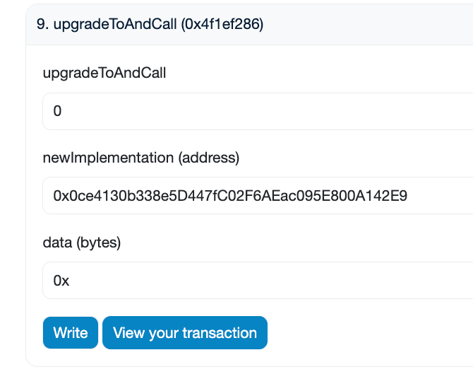

# MyToken.sol
## import 
- ERC20Upgradeable - 包含可升级功能的 ERC-20 代币
- OwnableUpgradeable - 仅允许所有者执行某些功能（所有者可以被转移）
- ERC20PermitUpgradeable - 添加了一个许可功能，用户可以使用它来节省离线批准的成本
- Initializable - 类似于构造函数，我们将使用它来设置代币的初始参数
- UUPSUpgradeable - 我们的 ERC-20 代币将继承的通用可升级代理标准模式逻辑


## 关于 `_disableInitializers()` 的作用
- `_disableInitializers()` 在构造函数中调用的主要目的是锁定实现合约，确保没有任何初始化函数（即被 `initializer` 修饰的函数）能在直接对实现合约调用时被执行。这确实是为了保护实现合约，使其不被直接用于逻辑操作，而只能通过代理合约间接调用。
- 这个操作是为了防止在未来实现合约被误用或者被直接调用时对其进行初始化或重新初始化，因为这种直接操作会绕过代理合约，可能导致状态变量的不一致或安全问题。

## 关于 `initialize` 函数和 `initializer` 修饰符
- `initialize` 函数被 `initializer` 修饰，确实是为了防止这个函数在合约生命周期中被多次调用。`initializer` 修饰符利用内部状态变量来跟踪函数是否已被调用过，并在尝试重复调用时阻止这一行为。
- `initializer` 修饰符的使用确保了初始化逻辑只在第一次部署代理合约时通过代理合约执行一次，对状态变量进行正确的设置。在合约升级过程中，如果部署了新的实现合约版本，通常也会配合一个新的初始化函数来更新或增加状态变量的初始化。


# 部署
## MyToken: address: 0x5DaE2b3aA08Dc2E473eef96b3CBB09F3302c26a9
```shell
➜  erc20_upgradeable git:(main) ✗ forge script script/deployToken.s.sol --rpc-url sepolia --account Dylan_5900 --broadcast
[⠔] Compiling...
No files changed, compilation skipped
Enter keystore password:
Script ran successfully.

== Logs ==
  implementation address: 0x5DaE2b3aA08Dc2E473eef96b3CBB09F3302c26a9

## Setting up 1 EVM.

==========================

Chain 11155111

Estimated gas price: 4.001773325 gwei

Estimated total gas used for script: 2191122

Estimated amount required: 0.00876837357142065 ETH

==========================

##### sepolia
✅  [Success]Hash: 0x9f4f0368bd1082a255266f2ab2c33a96b2f0333f9ac4ca5e698d0c7c3f5d19ff
Contract Address: 0x5DaE2b3aA08Dc2E473eef96b3CBB09F3302c26a9
Block: 6389743
Paid: 0.003372670406517705 ETH (1685961 gas * 2.000443905 gwei)

✅ Sequence #1 on sepolia | Total Paid: 0.003372670406517705 ETH (1685961 gas * avg 2.000443905 gwei)
                                                                                               

==========================

ONCHAIN EXECUTION COMPLETE & SUCCESSFUL.

Transactions saved to: /Volumes/T7 Shield/Code_apps/MacBook_github/OpenSpace_Homework/W4D5/erc20_upgradeable/broadcast/deployToken.s.sol/11155111/run-latest.json

Sensitive values saved to: /Volumes/T7 Shield/Code_apps/MacBook_github/OpenSpace_Homework/W4D5/erc20_upgradeable/cache/deployToken.s.sol/11155111/run-latest.json
```

## DeployUUPSProxy: address: 0x118aE00b6792392c80f6Ee10f31FE243aA30079e
```shell
➜  erc20_upgradeable git:(main) ✗ forge script script/deployProxy.s.sol:DeployUUPSProxy --rpc-url sepolia --account Dylan_5900 --broadcast --verify
[⠒] Compiling...
[⠃] Compiling 1 files with Solc 0.8.26
[⠊] Solc 0.8.26 finished in 2.19s
Compiler run successful!
Enter keystore password:
Script ran successfully.

== Logs ==
  UUPS Proxy Address:  0x118aE00b6792392c80f6Ee10f31FE243aA30079e

## Setting up 1 EVM.

==========================

Chain 11155111

Estimated gas price: 29.304387167 gwei

Estimated total gas used for script: 419987

Estimated amount required: 0.012307461653106829 ETH

==========================

##### sepolia
✅  [Success]Hash: 0xde2b76bc1983c8ce10147a08aa3e0a891b00b8ebfbb88dd7c1d0aaa17bb4f14e
Contract Address: 0x118aE00b6792392c80f6Ee10f31FE243aA30079e
Block: 6389976
Paid: 0.004644599305284435 ETH (323143 gas * 14.373201045 gwei)

✅ Sequence #1 on sepolia | Total Paid: 0.004644599305284435 ETH (323143 gas * avg 14.373201045 gwei)
                                                                                               

==========================

ONCHAIN EXECUTION COMPLETE & SUCCESSFUL.
##
Start verification for (1) contracts
Start verifying contract `0x118aE00b6792392c80f6Ee10f31FE243aA30079e` deployed on sepolia

Submitted contract for verification:
        Response: `OK`
        GUID: `ijvihuumbhwyi8l6syyzzwglmutekjmscakelank69gfre2nlw`
        URL: https://sepolia.etherscan.io/address/0x118ae00b6792392c80f6ee10f31fe243aa30079e
Contract verification status:
Response: `NOTOK`
Details: `Pending in queue`
Contract verification status:
Response: `NOTOK`
Details: `Already Verified`
Contract source code already verified
All (1) contracts were verified!

Transactions saved to: /Volumes/T7 Shield/Code_apps/MacBook_github/OpenSpace_Homework/W4D5/erc20_upgradeable/broadcast/deployProxy.s.sol/11155111/run-latest.json

Sensitive values saved to: /Volumes/T7 Shield/Code_apps/MacBook_github/OpenSpace_Homework/W4D5/erc20_upgradeable/cache/deployProxy.s.sol/11155111/run-latest.json
```

## Is this a proxy?
```
The proxy contract verification completed with the message:

The proxy's (0x118ae00b6792392c80f6ee10f31fe243aa30079e) implementation contract is found at: 0x5dae2b3aa08dc2e473eef96b3cbb09f3302c26a9
```

## 在代理合约中，都初始化好了


查看代理合约 slot值
```shell
➜  erc20_upgradeable git:(main) ✗ cast rpc "eth_getStorageAt" 0x118aE00b6792392c80f6Ee10f31FE243aA30079e 0x360894a13ba1a3210667c828492db98dca3e2076cc3735a920a3ca505d382bbc  latest --rpc-url sepolia                                           
"0x0000000000000000000000005dae2b3aa08dc2e473eef96b3cbb09f3302c26a9"
➜  erc20_upgradeable git:(main) ✗ cast rpc "eth_getStorageAt" 0x118aE00b6792392c80f6Ee10f31FE243aA30079e 0xb53127684a568b3173ae13b9f8a6016e243e63b6e8ee1178d6a717850b5d6103  latest --rpc-url sepolia
"0x0000000000000000000000000000000000000000000000000000000000000000"
```

同时在MyToken合约中，都没有初始化


## MyTokenV2: address: 0xefEba4A1D4Da5f7BaAB1d0560C5AA2ECdF02ebF6
```shell
➜  erc20_upgradeable git:(main) ✗ forge script script/deployTokenV2.s.sol --rpc-url sepolia --account Dylan_5900 --broadcast --verify
[⠆] Compiling...
[⠔] Compiling 1 files with Solc 0.8.26
[⠒] Solc 0.8.26 finished in 2.16s
Compiler run successful!
Enter keystore password:
Script ran successfully.

== Logs ==
  implementation address: 0xefEba4A1D4Da5f7BaAB1d0560C5AA2ECdF02ebF6

## Setting up 1 EVM.

==========================

Chain 11155111

Estimated gas price: 15.734209095 gwei

Estimated total gas used for script: 2192791

Estimated amount required: 0.034501832095634145 ETH

==========================

##### sepolia
✅  [Success]Hash: 0x5f8191f6fbe769d671217c9362118e90696b0bb2cdf56d193b821b34b174958a
Contract Address: 0xefEba4A1D4Da5f7BaAB1d0560C5AA2ECdF02ebF6
Block: 6390163
Paid: 0.012994094345768655 ETH (1687245 gas * 7.701367819 gwei)

✅ Sequence #1 on sepolia | Total Paid: 0.012994094345768655 ETH (1687245 gas * avg 7.701367819 gwei)
                                                                                                                                                                               

==========================

ONCHAIN EXECUTION COMPLETE & SUCCESSFUL.
##
Start verification for (1) contracts
Start verifying contract `0xefEba4A1D4Da5f7BaAB1d0560C5AA2ECdF02ebF6` deployed on sepolia
Submitting verification for [src/MyTokenV2.sol:MyTokenV2] 0xefEba4A1D4Da5f7BaAB1d0560C5AA2ECdF02ebF6.
Submitted contract for verification:
        Response: `OK`
        GUID: `f19ikace4veht4fr6zqvdryeean7pk65evtfznzhsspbhqvhrd`
        URL: https://sepolia.etherscan.io/address/0xefeba4a1d4da5f7baab1d0560c5aa2ecdf02ebf6
Contract verification status:
Response: `NOTOK`
Details: `Pending in queue`
Contract verification status:
Response: `OK`
Details: `Pass - Verified`
Contract successfully verified
All (1) contracts were verified!

Transactions saved to: /Volumes/T7 Shield/Code_apps/MacBook_github/OpenSpace_Homework/W4D5/erc20_upgradeable/broadcast/deployTokenV2.s.sol/11155111/run-latest.json

Sensitive values saved to: /Volumes/T7 Shield/Code_apps/MacBook_github/OpenSpace_Homework/W4D5/erc20_upgradeable/cache/deployTokenV2.s.sol/11155111/run-latest.json
```

## 查看插槽
```shell
➜  erc20_upgradeable git:(main) ✗ cast rpc "eth_getStorageAt" 0x118aE00b6792392c80f6Ee10f31FE243aA30079e 0x360894a13ba1a3210667c828492db98dca3e2076cc3735a920a3ca505d382bbc  latest --rpc-url sepolia                                           
"0x0000000000000000000000005dae2b3aa08dc2e473eef96b3cbb09f3302c26a9"
```

换实现合约：


```shell
➜  erc20_upgradeable git:(main) ✗ cast rpc "eth_getStorageAt" 0x118aE00b6792392c80f6Ee10f31FE243aA30079e 0x360894a13ba1a3210667c828492db98dca3e2076cc3735a920a3ca505d382bbc  latest --rpc-url sepolia                                           
"0x000000000000000000000000efeba4a1d4da5f7baab1d0560c5aa2ecdf02ebf6"
```

再次初始化时，报错：


显示：Fail with error 'InvalidInitialization ()'

怀疑是MyTokenV1 和 MyTokenV2的初始化函数名是相同的。

## 部署 MyTokenV3: address: 0x0ce4130b338e5D447fC02F6AEac095E800A142E9
```shell
➜  erc20_upgradeable git:(main) ✗ forge script script/deployTokenV3.s.sol --rpc-url sepolia --account Dylan_5900 --broadcast --verify
[⠑] Compiling...
[⠃] Compiling 2 files with Solc 0.8.26
[⠊] Solc 0.8.26 finished in 2.17s
Compiler run successful!
Enter keystore password:
Script ran successfully.

== Logs ==
  implementation address: 0x0ce4130b338e5D447fC02F6AEac095E800A142E9

## Setting up 1 EVM.

==========================

Chain 11155111

Estimated gas price: 19.885234985 gwei

Estimated total gas used for script: 2192791

Estimated amount required: 0.043604164307993135 ETH

==========================

##### sepolia
✅  [Success]Hash: 0x136207cccd9f392f7dc020a9982480c53d3abc29e389e3056f082116b3b3f5ed
Contract Address: 0x0ce4130b338e5D447fC02F6AEac095E800A142E9
Block: 6390423
Paid: 0.016393020121193415 ETH (1687245 gas * 9.715850467 gwei)

✅ Sequence #1 on sepolia | Total Paid: 0.016393020121193415 ETH (1687245 gas * avg 9.715850467 gwei)
                                                        
==========================

ONCHAIN EXECUTION COMPLETE & SUCCESSFUL.
##
Start verification for (1) contracts
Start verifying contract `0x0ce4130b338e5D447fC02F6AEac095E800A142E9` deployed on sepolia

Submitted contract for verification:
        Response: `OK`
        GUID: `rjf6u4cjjlzpbhis4ibvxlp2xnw7w6naybjf9nlqp28jisiqmz`
        URL: https://sepolia.etherscan.io/address/0x0ce4130b338e5d447fc02f6aeac095e800a142e9
Contract verification status:
Response: `NOTOK`
Details: `Pending in queue`
Contract verification status:
Response: `OK`
Details: `Pass - Verified`
Contract successfully verified
All (1) contracts were verified!

Transactions saved to: /Volumes/T7 Shield/Code_apps/MacBook_github/OpenSpace_Homework/W4D5/erc20_upgradeable/broadcast/deployTokenV3.s.sol/11155111/run-latest.json

Sensitive values saved to: /Volumes/T7 Shield/Code_apps/MacBook_github/OpenSpace_Homework/W4D5/erc20_upgradeable/cache/deployTokenV3.s.sol/11155111/run-latest.json
```

## 更换实现合约为V3


查看插槽
```shell
➜  erc20_upgradeable git:(main) ✗ cast rpc "eth_getStorageAt" 0x118aE00b6792392c80f6Ee10f31FE243aA30079e 0x360894a13ba1a3210667c828492db98dca3e2076cc3735a920a3ca505d382bbc  latest --rpc-url sepolia
"0x0000000000000000000000000ce4130b338e5d447fc02f6aeac095e800a142e9"
```

调用intializeV3，还是报错，说明不是函数名的问题

# 未解决的问题
明明UUPSUpgradeable合约中的_authorizeUpgrade函数是未定义的，按理说，人人都可以更改实现合约的地址，但是用别的账户是改不了的，只能是部署代理合约的账户才能修改。暂时没有找到关于这部分逻辑的代码在哪里。