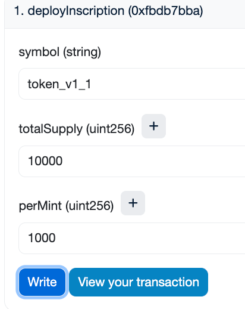
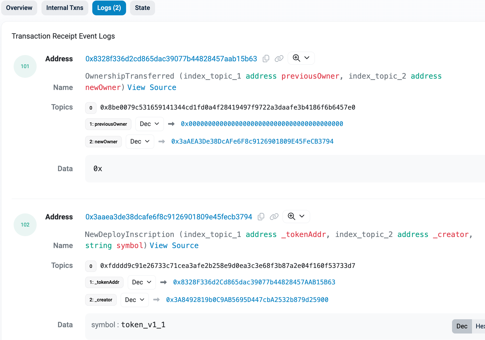
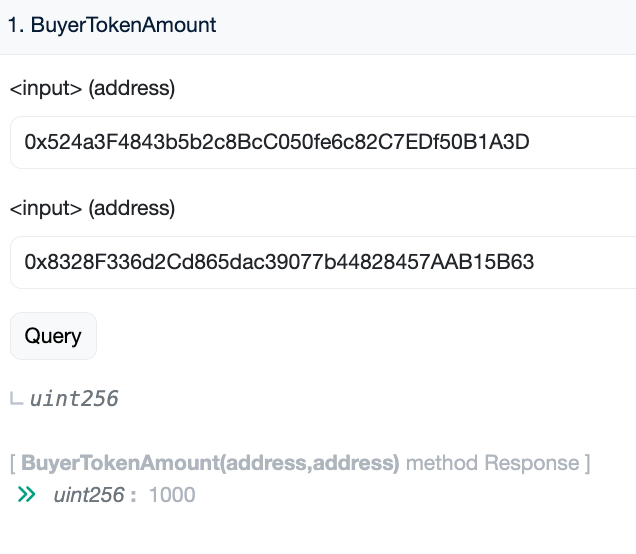
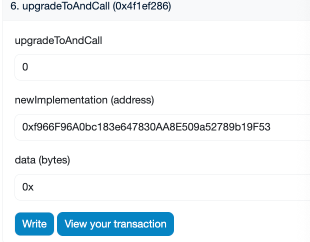
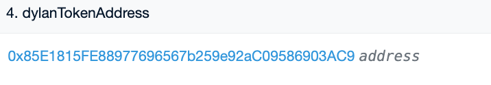
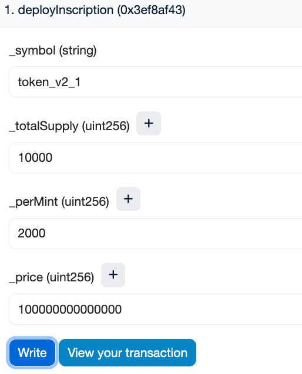
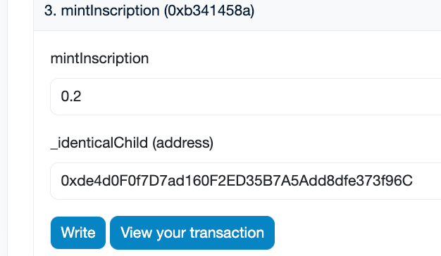
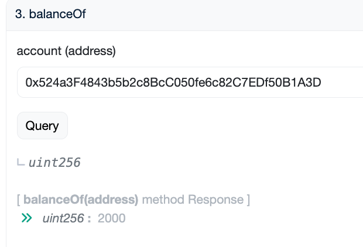
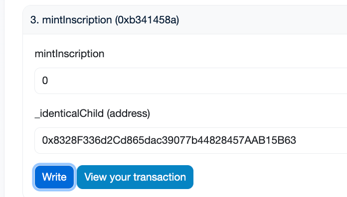
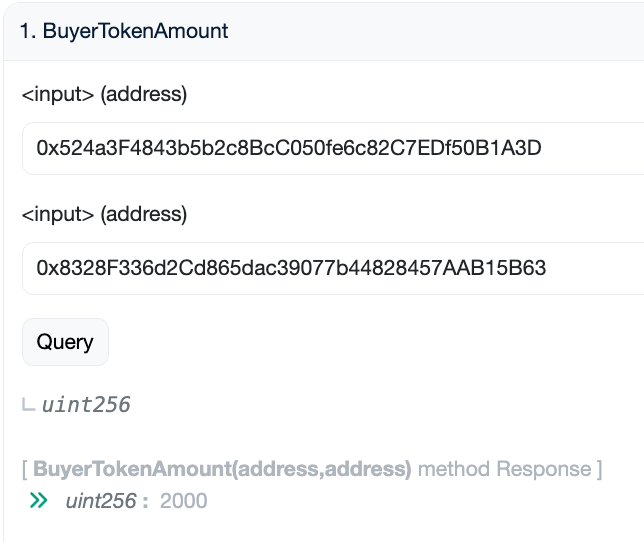

# 部署
## TokenFactory_v1: address: 0x34917fEc34Aab7B9989c4C297fF9723DAA81EDF9
```shell
➜  token_factory_upgradeable git:(main) ✗ forge script --rpc-url sepolia --account Dylan_5900 script/deployTokenFactory_v1.s.sol --broadcast --verify

== Logs ==
  implementation_v1_contract address:  0x34917fEc34Aab7B9989c4C297fF9723DAA81EDF9
## Setting up 1 EVM.
==========================
Chain 11155111
Estimated gas price: 6.533427842 gwei
Estimated total gas used for script: 2136234
Estimated amount required: 0.013956930692627028 ETH
==========================
##### sepolia
✅  [Success]Hash: 0x1ee6f7c17430fdef656acb80c062b1656986c3372b8dbd886190b6e8d2622a1c
Contract Address: 0x34917fEc34Aab7B9989c4C297fF9723DAA81EDF9
Block: 6404717
Paid: 0.006121056886084365 ETH (1643727 gas * 3.723888995 gwei)

✅ Sequence #1 on sepolia | Total Paid: 0.006121056886084365 ETH (1643727 gas * avg 3.723888995 gwei)
```

## UUPSPRoxy: address: 0x3aAEA3De38DcAFe6F8c9126901809E45FeCB3794
```shell
➜  token_factory_upgradeable git:(main) ✗ forge script --rpc-url sepolia --account Dylan_5900 script/DeployFactoryProxy.s.sol --broadcast --verify

== Logs ==
  UUPS Proxy Address: 0x3aAEA3De38DcAFe6F8c9126901809E45FeCB3794
  data:
  0xc4d66de80000000000000000000000003a8492819b0c9ab5695d447cba2532b879d25900
## Setting up 1 EVM.
==========================
Chain 11155111
Estimated gas price: 2.906203584 gwei
Estimated total gas used for script: 234855
Estimated amount required: 0.00068253644272032 ETH
==========================
##### sepolia
✅  [Success]Hash: 0x43b0d4701dbf58e1c1fc1e57a3a1e6a2fd3ba52d7a2b48471dbcd415b9d33154
Contract Address: 0x3aAEA3De38DcAFe6F8c9126901809E45FeCB3794
Block: 6404800
Paid: 0.000354691658446232 ETH (180734 gas * 1.962506548 gwei)

✅ Sequence #1 on sepolia | Total Paid: 0.000354691658446232 ETH (180734 gas * avg 1.962506548 gwei)
```

### 查看插槽
```shell
➜  token_factory_upgradeable git:(main) ✗ cast rpc "eth_getStorageAt" 0x3aAEA3De38DcAFe6F8c9126901809E45FeCB3794 0x360894a13ba1a3210667c828492db98dca3e2076cc3735a920a3ca505d382bbc  latest --rpc-url sepolia
"0x00000000000000000000000034917fec34aab7b9989c4c297ff9723daa81edf9"
```

# 基于TokenFactory_v1交互
## new Token_v1_1: address: 0x8328F336d2Cd865dac39077b44828457AAB15B63  


交易日志：  
new出来的token地址：0x8328F336d2Cd865dac39077b44828457AAB15B63  
owner是代理地址（方便mint）：0x3aAEA3De38DcAFe6F8c9126901809E45FeCB3794  
  

==gas：711,298==

## mintInscription


算Token_v1_1的balances(mapping)的位置：
```solidity
contract b {
        address key = 0x524a3F4843b5b2c8BcC050fe6c82C7EDf50B1A3D;
        uint256 slot = 0;  // _balances的存储槽位

    function hash_a() public view returns(bytes32) {
        bytes32 storageLocation = keccak256(abi.encode(key, slot));

        return storageLocation;
    }
}
```

查看插槽：
```shell
➜  token_factory_upgradeable git:(main) ✗ cast rpc "eth_getStorageAt" 0x8328F336d2Cd865dac39077b44828457AAB15B63 0xfa97cab05d109004ee5e870b89607dfd22aeda948ceb9a9f6dabf64b8affd62c  latest --rpc-url sepolia
"0x00000000000000000000000000000000000000000000000000000000000003e8"
```

# 升级成TokenFactory_v2
## 部署TokenFactory_v2: address: 0xf966F96A0bc183e647830AA8E509a52789b19F53
```shell
➜  token_factory_upgradeable git:(main) ✗ forge script --rpc-url sepolia --account Dylan_5900 script/deployTokenFactory_v2.s.sol --broadcast --verify

== Logs ==
  implementation_v2_contract address:  0xf966F96A0bc183e647830AA8E509a52789b19F53
## Setting up 1 EVM.
==========================
Chain 11155111
Estimated gas price: 6.808634127 gwei
Estimated total gas used for script: 1385061
Estimated amount required: 0.009430373592576747 ETH
==========================
##### sepolia
✅  [Success]Hash: 0x7a710f4412405d7657ded1b12d16d854dddb7db949c7d30c531c629582f4138e
Contract Address: 0xf966F96A0bc183e647830AA8E509a52789b19F53
Block: 6404972
Paid: 0.003830126292374402 ETH (1065734 gas * 3.593885803 gwei)

✅ Sequence #1 on sepolia | Total Paid: 0.003830126292374402 ETH (1065734 gas * avg 3.593885803 gwei)
```

## upgradeToAndCall
  
查看插槽：  
```shell
➜  token_factory_upgradeable git:(main) ✗ cast rpc "eth_getStorageAt" 0x3aAEA3De38DcAFe6F8c9126901809E45FeCB3794 0x360894a13ba1a3210667c828492db98dca3e2076cc3735a920a3ca505d382bbc  latest --rpc-url sepolia
"0x000000000000000000000000f966f96a0bc183e647830aa8e509a52789b19f53"
```

## 换ERC20合约
部署DylanToken_v2: address: 0x85E1815FE88977696567b259e92aC09586903AC9  
调用setERC20ImplementationAddress:  


## 部署新的铭文 => 最小代理
  
最小代理合约地址： 0xde4d0F0f7D7ad160F2ED35B7A5Add8dfe373f96C  
==gas：287,463==

## mint token_v2
  
去最小代理合约界面查看balances:  


## mint token_v1
  
查看余额：  
  
查看插槽：  
```shell
➜  token_factory_upgradeable git:(main) ✗ cast rpc "eth_getStorageAt" 0x8328F336d2Cd865dac39077b44828457AAB15B63 0xfa97cab05d109004ee5e870b89607dfd22aeda948ceb9a9f6dabf64b8affd62c  latest --rpc-url sepolia
"0x00000000000000000000000000000000000000000000000000000000000007d0"
```

升级成功，前后状态不变，同时deployInscription时，gas更少。