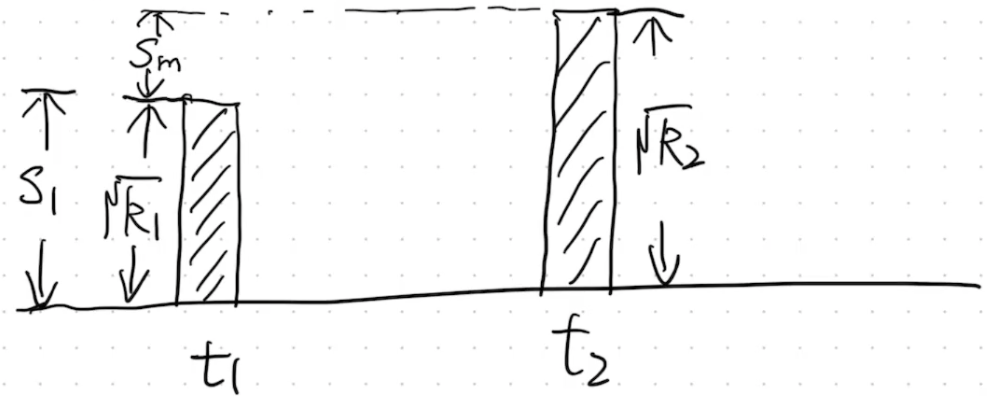
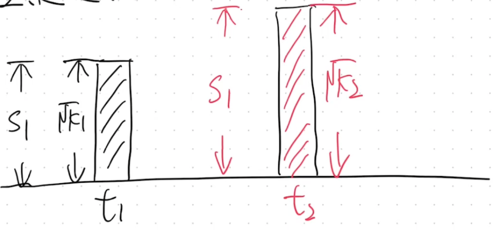
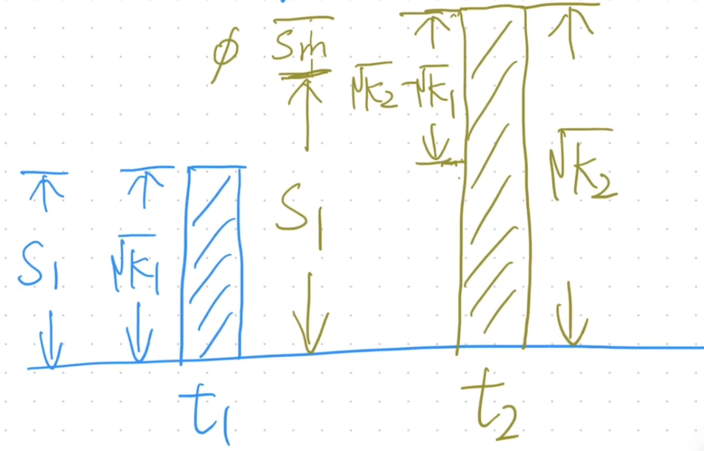
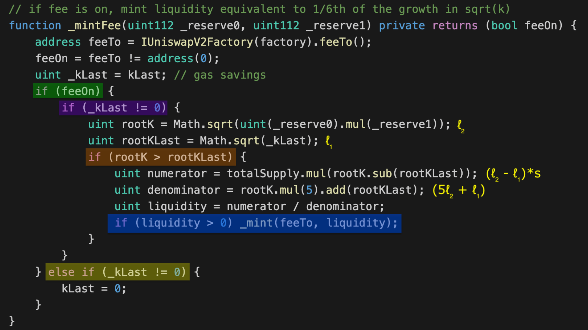

白皮书2.4章节：https://uniswap.org/whitepaper.pdf

手续费的作用：对于去中心化交易所来说，流动性是其最大的保证，不然别人也不会过来玩，或者说流动性太小，交易不会很顺畅，滑点也会很大。那么作为去中心化交易所，需要有方法来激励别人来你这里去做流动性。手续费就是一个非常重要的一个因素。

有什么办法既分点手续费给LP，又分点给自己的团队？

### 手续费的来源
在 Uniswap V2 中，每笔交易都会收取 0.3% 的手续费。这些手续费来源于交易中的资金流动，即用户在交换两种代币（比如从 TokenA 兑换到 TokenB）时，部分代币作为手续费留在流动性池中。

### 手续费存在方式
虽然理论上存在几种分配手续费的方式，Uniswap V2 实际上采用了以下方法来处理和分配这些手续费：
1. **增发 LP Token**：
   - 理论上，平台可以选择通过增发新的流动性提供者代币（LP Token）来直接分配手续费。这种方式意味着流动性提供者会收到更多的 LP Token，代表他们在池中的份额增加了。
   - **但是，Uniswap V2 没有采用这种方式。**

2. **增加池中的 Token 数量**（Uniswap V2 采用的方式）：
   - 由于每笔交易会有一个 0.3% 的手续费，这个费用直接加入到流动性池中，不是通过外部分配机制分配。这意味着手续费自动转化为增加池中的资产（tokenA 和 tokenB）。具体来说，如果有人使用 TokenA 来兑换 TokenB，那么部分 TokenA 作为手续费被留在池中，从而增加了池中 TokenA 和 TokenB 的数量。
   - 由于池中的 tokenA 和 tokenB 增加了，持有的 LP Token 代表的价值随之增加。

## 手续费分配方式
### 1. 通过增发的方式将手续费给项目方
因为项目方在池子中并没有 share，所以需要进行增发即 $S_m$ 部分
两个公式：$X * Y = K$,    $S = L = \sqrt[]{X * Y} = \sqrt[]{K}$

在$t_1$这个时间点，流动性$L_1 = S_1 = \sqrt[]{K_1}$。
到达$t_2$时，假设经过大量的交易，收取了大量的手续费，此时，$L_2 = \sqrt[]{K_2}$  
  
$S_1$：LP 提供流动性得到的 share 数量 
$S_m$：系统按手续费比例增发的 share 数量
$\sqrt{k_1}$：添加流动性对应的 k 值 
$\sqrt{k_2}$：添加流动性加上增发的 share 所对应的 k 值

$$\begin{aligned} \frac{S_m}{S_1+S_m}&=\frac{\sqrt{k_2}-\sqrt{k_1}}{\sqrt{k_2}} \\ S_m*\sqrt{k_2}&=S_1*\sqrt{k_2}+S_m*\sqrt{k_2}-S_1*\sqrt{k_1}-S_m*\sqrt{k_1}(化简) \\ S_m&=\frac{\sqrt{k_2}-\sqrt{k_1}}{\sqrt{k_1}}*S_1 \end{aligned}$$

### 2. 通过将S1增值的方式将手续费给LP
LP 的手续费并不是给 LP 增发新的 share 即 $S_m=0$，而是仍然是 $S_1$ 的数量，但随着手续费的累积，k 值会变大（此时可以理解为，LP 的 share 数量没有变化，在没有手续费收入的时候只共享$S_1$ 价值，在有手续费收入的时候则共享 $S_1$+手续费 价值 ）  
  
原来$S1$对应$\sqrt{k_1}$，$S1$对应$\sqrt{k_2}$

增值比例：$\frac{\sqrt{k_2}-\sqrt{k_1}}{\sqrt{k_1}}$
原来一个LPT增值后，对应的价值变成$1 + \frac{\sqrt{k_2}-\sqrt{k_1}}{\sqrt{k_1}}$，其中$\sqrt{k_2} > \sqrt{k_1}$
即，原来1 LPT 对应 1 token_A 和 1 token_B；
现在 1 LPT 对应$1 + \frac{\sqrt{k_2}-\sqrt{k_1}}{\sqrt{k_1}}$ token_A 和 $1 + \frac{\sqrt{k_2}-\sqrt{k_1}}{\sqrt{k_1}}$ token_B

例子：最开始有100 DAI：1 ETH (k 值为 $\sqrt{100}$)，经过一系列的交换，此时池子中有 96 DAI：1.5 ETH (k 值为$\sqrt{144}$)

### 3. 项目方拿取一定比例（用$\phi$表示，为 $S_m$ 占整个增发部分的比例）的手续费

  
由上面可得，
$$ \frac{S_m}{S_m+S_1}=\frac{\sqrt{k_2}-\sqrt{k_1}}{\sqrt{k_2}}*\phi $$
$\frac{S_m}{S_m+S_1}$ 表示的是项目方增发的比例，$\frac{\sqrt{k_2}-\sqrt{k_1}}{\sqrt{k_1}}$ 表示的是 LP 增加的比例

由此可以推导出
$$\begin{aligned} S_m*\sqrt{k_2} &= S_m*\sqrt{k_2}*\phi + S_1*\sqrt{k_2}*\phi - S_m*\sqrt{k_1}*\phi - S_1*\sqrt{k_1}*\phi \\ S_m &= \frac{(\sqrt{k_2}-\sqrt{k_1})*S_1}{(\frac{1}{\phi}-1)\sqrt{k_2}+\sqrt{k_1}} \end{aligned}$$

当 $\phi=1$ 时，则为手续费全给项目方时所得到的公式：
$$S_m = \frac{(\sqrt{k_2}-\sqrt{k_1})*S_1}{\sqrt{k_1}}$$
也就是将增值的部分全部拿走。
因此，先增值，然后项目方将增值中的$\phi$拿走，剩下的增值部分由LP拿走。

uniswap v2真正用到收手续费的公式（$\phi=\frac{1}{6}$）：
$$S_m = \frac{(\sqrt{k_2}-\sqrt{k_1})*S_1}{5 * \sqrt{k_2}+\sqrt{k_1}}$$

## 代码：
  
`rootK`就是$K_1$，`rootKLast`就是$K_2$。
这个函数是项目要收取手续费，它有一个开关，目前这个开关是关闭的。
这个手续费只有在添加流动性和移除流动性的时候收，每次添加或移除流动性都会进行share的mint或burn：

如果feeOn打开了，那么就记录一下kLast，调用_mintFee()来收手续费：  
  

  

