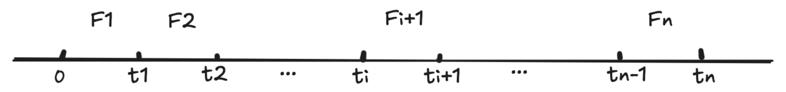

# Add NFTMarket Features  
1. Charge NFT transaction fee
2. Support Stake ETH to earn transaction fee

# 单利
  
假设每个时间段的奖励是 $F_i$  

---
假设用户在0时刻质押（借/存）的本金是 $S_A$ ，总质押额为 $S_{T_i}$

在 $t_1$ 时刻，用户能够获得的奖励为： $R_1 = F_1 * \frac{S_A}{S_{T_1}} = S_A * \frac{F_1}{S_{T_1}}$  
在 $t_2$ 时刻，用户能够获得的奖励为： $R_2 = S_A * \frac{F_1}{S_{T_1}} + S_A * \frac{F_2}{S_{T_2}} = S_A * （\frac{F_1}{S_{T_1}} + \frac{F_2}{S_{T_2}}）$  
在 $t_n$ 时刻，用户能够获得的奖励为： $R_n = S_A * （\frac{F_1}{S_{T_1}} + ... + \frac{F_n}{S_{T_n}})$  

---
如果用户是在 $t_i$ 时刻质押的，求 $t_i$ 到 $t_n$ 这期间的奖励： 
$$R_i^n = S_A * （\frac{F_{i+1}}{S_{T_1}} + ... + \frac{F_n}{S_{T_n}}) = S_A *（\frac{F_1}{S_{T_1}} + ... + \frac{F_i}{S_{T_i}} + \frac{F_{i+1}}{S_{T_{i+1}}} + ... + \frac{F_n}{S_{T_n}}) - (\frac{F_1}{S_{T_1}} + ... + \frac{F_i}{S_{T_i}})$$  
即：  
$$R_i^n  = S_A *（\sum_{k=1}^{n}\frac{F_k}{S_{T_k}} - \sum_{k=1}^{i}\frac{F_k}{S_{T_k}})$$  
$\sum_{k=1}^{n}\frac{F_k}{S_{T_k}}$ 就相当于当前池子中，每单位质押可以获得的奖励的累积值（即池子的累积利率）  
$\sum_{k=1}^{i}\frac{F_k}{S_{T_k}}$ 相当于用户在上一次质押时，那个时刻池子的每单位质押可以获得的奖励的累积值（既用户的累积利率）  

## 代码思路
将更新池子中所有质押者的计算时间复杂度从 O(n) 变成 O(1)  
  
1. 当池子里的奖励发生变化时，需要更新 $\sum_{k=1}^{n}\frac{F_k}{S_{T_k}}$ ，也就是更新当前池子中，每单位质押可以获得的奖励的累积值。  
  
2. 当用户（质押、解押、领取奖励）时，需要先更新一下他上一时刻的奖励：   
$$R_i^n  += S_A *（\sum_{k=1}^{n}\frac{F_k}{S_{T_k}} - \sum_{k=1}^{i}\frac{F_k}{S_{T_k}})$$  
	然后将他的 $\sum_{k=1}^{i}\frac{F_k}{S_{T_i}}$ = $\sum_{k=1}^{n}\frac{F_k}{S_{T_i}}$ 。  
	如果领取奖励，那么就结束了。  
	如果是质押或解押，需要更新 $S_A$  和 ${S_{T_n}}$  