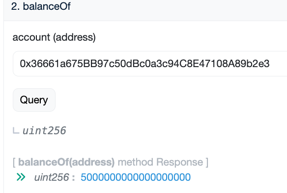
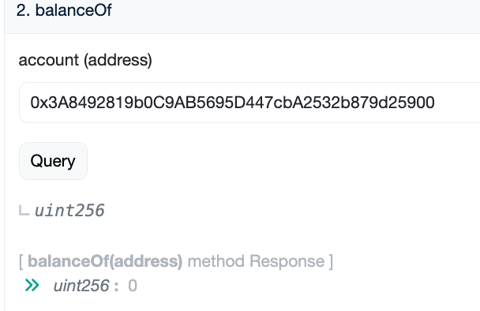
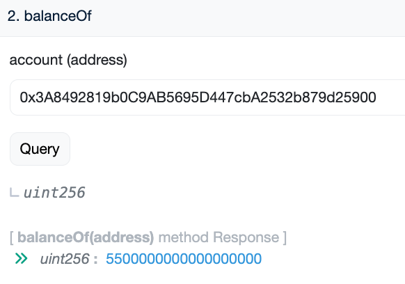
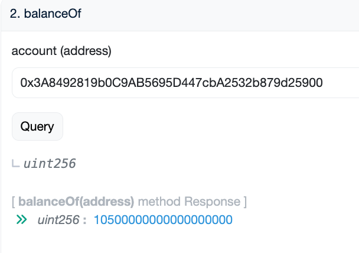

# install
- `forge install smartcontractkit/chainlink --no-commit`
- `forge install OpenZeppelin/openzeppelin-contracts --no-commit`

# deploy
## DylanToken: address: 0xb3260892C5D3D7B75BD5F678345AFB01213aeb6E
```shell
➜  AUTOMATION_BANK git:(main) ✗ forge create --rpc-url sepolia --account Dylan_5900 DylanToken         
[⠊] Compiling...
No files changed, compilation skipped
Enter keystore password:
Deployer: 0x3A8492819b0C9AB5695D447cbA2532b879d25900
Deployed to: 0xb3260892C5D3D7B75BD5F678345AFB01213aeb6E
Transaction hash: 0x5360668c1b30a0ef00193a930fb1ee7ce22adc208cd257df63e633c3434d4c79
```

## automationBank: address: 0x36661a675BB97c50dBc0a3c94C8E47108A89b2e3
```shell
➜  AUTOMATION_BANK git:(main) ✗ forge create --rpc-url sepolia --account Dylan_5900 automationBank --constructor-args 0xb3260892C5D3D7B75BD5F678345AFB01213aeb6E
[⠊] Compiling...
No files changed, compilation skipped
Enter keystore password:
Deployer: 0x3A8492819b0C9AB5695D447cbA2532b879d25900
Deployed to: 0x36661a675BB97c50dBc0a3c94C8E47108A89b2e3
Transaction hash: 0xe2c8bfff5b3dfe958e25610d509f75e730e5bbed7dc9648fc5c2b0b986b3cb25
```

# Upkeep registration
## time-based
https://automation.chain.link/sepolia/45483036732464704843132457427233242968581788269418166664277981953233959672234
```shell
Wallet address:
0x3a8492819b0c9ab5695d447cba2532b879d25900
Registrar address:
0xb0e49c5d0d05cbc241d68c05bc5ba1d1b7b72976
Upkeep registration hash:
0xbbd1fe30f541b5ea391ae79f1dcc136b8e8d3da131fc08540f8f2c60b64f9ce8
```

# 交互
- 使用`account3`mint 10e18个token，并授权给`automationBank`。  
- 使用`account1`设置`threshold`为10e18。  

`account3`先`deposit(5e18)`  
  
`owner`帐上还没钱：  
  

`account3`再`deposit(6e18)`  
`owner`帐上的钱：`55e17`  
  
`account3`再`deposit(45e17)`  
`owner`帐上的钱：`55e17+5e18=105e17`  
  

## Chainlink Automation
在 Chainlink 的 Automation (以前称为 Chainlink Keepers) 框架中，`AutomationCompatibleInterface` 接口定义了两个关键函数 `checkUpkeep` 和 `performUpkeep`，这两个函数使得智能合约能够自动化执行任务。

### 1. `checkUpkeep`
此函数由 Chainlink 的 keeper 节点周期性地调用，用来检测是否需要执行维护或者更新操作。该函数是仿真执行的，不会真正改变链上状态，所以可以使用很多计算资源来完成复杂的检查。

- **参数**：
  - `checkData`：是在注册 upkeep 任务时指定的数据，每次调用该函数时都相同。通过 `abi.decode` 可以将这些数据解码成具体的参数，从而允许在同一个合约上注册多个 upkeep 任务，并且能够通过合约轻松区分它们。

- **返回值**：
  - `upkeepNeeded`：布尔值，表示是否需要执行 `performUpkeep`。
  - `performData`：如果需要维护，这是一个字节序列，keeper 节点将用这些数据调用 `performUpkeep` 函数。这个数据通常包含了执行任务所需的所有信息，可以通过 `abi.encode` 编码，然后在 `performUpkeep` 中解码。

- **开发者提示**：
  - 虽然这个函数设计为仅仿真执行，但开发者可以通过添加 `cannotExecute` 修饰符（如果使用了 `KeeperBase`）来确保它不会被意外执行。

### 2. `performUpkeep`
这是实际由 keeper 执行的函数，通常在 `checkUpkeep` 表示需要维护时调用。该函数负责执行实际的状态更新或其他必要操作。

- **参数**：
  - `performData`：这是从 `checkUpkeep` 返回的数据，包含执行 upkeep 所需的所有信息。这个数据应当在执行前被验证，因为不能保证传递的数据完全可靠。

- **开发者提示**：
  - 输入数据不应被信任，应在执行任何操作前进行充分验证。因为可能存在恶意的 keeper，或者在执行 `performUpkeep` 时系统状态已经改变，或者存在并发的 keeper 调用。
  - 任何人都应该能够调用此方法，而不应限制调用者必须是特定的注册表或实体。


